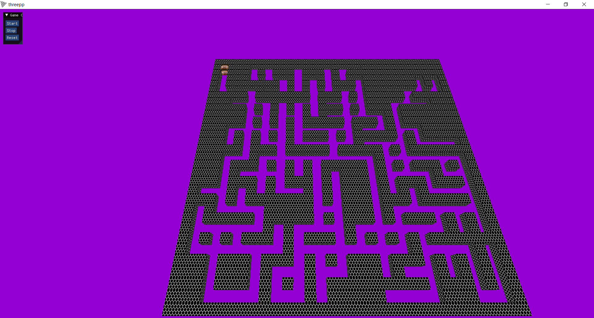

Kandidat nr. 10032

# MazeGame

MazeGame er et 3D labyrintspill hvor spilleren må navigere gjennom en labyrint for å nå målet. Målet med spillet blir da å finne spillets målpunkt raskest mulig. Hver gang spillet starter får man en ny maze med et nytt sluttpunkt. Spillet bruker OpenGL for å vise labyrinten og spillerens bevegelse i sanntid. Dette prosjektet er skrevet i C++ og bruker Threepp-biblioteket for å håndtere 3D-grafikk.




## Funksjoner

- En tilfeldig generert labyrint med justerbare dimensjoner og kompleksitet.
- Bevegelse i sanntid med W, A, S og D-tastene.
- Mulighet for start ved press av R tasten.
- Mulighet for å starte, stoppe og tilbakestille spillet via et ImGui-grensesnitt.
- Visning av spilletid og en gratulasjonsmelding ved fullføring av labyrinten.

## Testing

MazeGame inkluderer tester for å sikre at spillet fungerer som det skal. Disse testene er skrevet ved bruk av C++ `assert`-biblioteket og fokuserer på å verifisere både genereringen av labyrinten og spillets hovedfunksjoner.

Filen `maze_tests.cpp` inneholder en funksjon `test_maze_generation()` som tester følgende:

- Start- og sluttpunktene i labyrinten er ikke vegger.
- De ytre kantene av labyrinten er alle vegger.

Filen `game_test.cpp` inneholder en funksjon `test_game()` som tester følgende:

- Spillet ikke kjører ved oppstart.
- Spillet starter og stopper som forventet.
- Spillet kan resette tilstandene.
- Spillets seiers indikasjon fungerer som forventet.

Filen `main_test.cpp` kjører begge disse testene for å bekrefte at alle aspekter fungerer som forventet.

## Filstruktur
Prosjektet har følgende filstruktur:

````
MazeGame/
│
├── src/
│ ├── main.cpp
│ ├── maze.cpp
│ ├── game_imgui.cpp
│ ├── game.cpp
│ ├── box.cpp
│ └── texture_loader.hpp
│
├── include/
│ ├── maze.hpp
│ ├── game_imgui.hpp
│ ├── game.hpp
│ └── box.hpp
│
├── tests/
│ ├── maze_tests.cpp
│ ├── game_test.cpp
│ └── main_test.cpp
│
└── textures/
  ├── Hex.png
  ├── img.png
  └── steve.png
````


- `src/`: Denne mappen inneholder alle C++ kildefilene for prosjektet.
- `include/`: Denne mappen inneholder alle headerfilene for prosjektet.
- `tests/`: Denne mappen inneholder alle testfilene for prosjektet.
- `textures/`: Denne mappen inneholder alle bildefilene som tilhører prosjektet.

## Avhengigheter

- OpenGL
- GLFW
- GLEW
- GLM
- ImGui
- Threepp


